# T2A1 - Workbook
##### By Simon Curran
  

**NOTE:** *To find [my README.md](https://github.com/SimoSultan/ca-assignments/tree/master/t2a1) on GitHub if you're reading the PDF...*  
**SEARCH:** *SimoSultan -> Repositories -> ca-assignments -> t2a1*  

#### Navigation:
- [**Q1**](#Q1) - Rails Architecture
- [**Q2**](#Q2) - Pros and Cons of a PostgreSQL Database
- [**Q3**](#Q3) - Agile Methodology
- [**Q4**](#Q4) - Source Control Workflow
- [**Q5**](#Q5) - Software Testing Processes
- [**Q6**](#Q6) - Information System Security
- [**Q7**](#Q7) - Protecting Information and Data
- [**Q8**](#Q8) - Legal Obligations Handling User Data
- [**Q9**](#Q9) - Structural Aspects of a Relational Database
- [**Q10**](#Q10) - Integrity Aspects of a Relational Database
- [**Q11**](#Q11) - Manipulative Aspects of a Relational Database
- [**Q12**](#Q12) - Sorting Algorithms (Big-O)
- [**Q13**](#Q13) - Search Algorithms (Big-O)
- [**Q14**](#Q14) - Marketplace Website Research

***

## Q1:

The overall architecture of a Ruby on Rails application has the following features:

- Model-View-Controller architecture.
- Representational State Transfer (REST) for web services.
- Support for major databases.
- Convention over configuration.

These features are discussed in further detail below.

### **Model-View-Controller Architecture**

- **Model**  
The Model represents the information in the database and handles the business logic of the application, where it manipulates and validates the data. Then passing that information back to the controller, which in turn sends it to the view. Some of the major databases that the model connect to that are used in Rails are: MySQL, Oracle, MS SQL Server, PostgreSQL, IBM DB2, and more.

- **View**  
The View is the front-end of the application, AKA the user interface (UI), AKA the webpage that the user 'views'. These are HTML files with Ruby code embedded in them (ERB). Generally, this Ruby code is fairly simple, and it accesses the variables that are in the corresponding Controller Action, which was passed from the Model/Database.

- **Controller**  
Controllers are the middle-person between the Model and View. It receives requests from the View/browser, processes it, then asks the Model for the corresponding data, which then returns it back to the View/user. The Controller should always/ideally be kept as lightweight of code as possible, because the majority of the logic should be handled by the Model.

### **RESTful Architecture**

Representational State Transfer (REST) relies on the HTTP protocol for all the CRUD operations: 'Create', 'Read', 'Update' and 'Delete'. These operations are placed in the 'routes.rb' file, and are the main way that computers talk to each other over the internet.

The interaction between these components can be seen below in the figure.

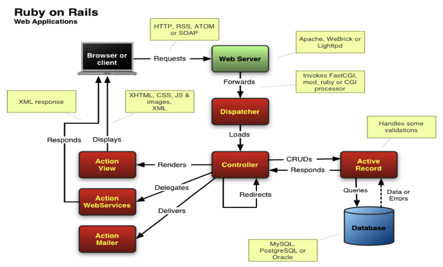  
Reference model depicting the overall framework architecture.  
***Note: original source of image cannot be found due to a broken link on referenced webpage.***

### **Convention Over Configuration**
Rails has been built with convention in mind. This concept was introduced by David Heinemeier Hansson (creator of Ruby on Rails), as it decreases the number of decisions a developer is required to make, without losing flexibility. For a *very small* example is when naming files in the MVC, i.e. controllers should be plural, and a model should be singular. 

***Resources Used:***  
[1] [Adrien Mejia ](https://adrianmejia.com/ruby-on-rails-architectural-design/#:~:text=Model%2DView%2DController%20Pattern,deals%20with%20the%20application%20flow.)  
[2] [Sitepoint](https://www.sitepoint.com/model-view-controller-mvc-architecture-rails/)  
[3] [Medium](https://medium.com/the-renaissance-developer/ruby-on-rails-http-mvc-and-routes-f02215a46a84)  

***

## Q2:

PostgreSQL (initially called Postgres) was created by a computer science professor Michael Stonebraker and his team, and became one of the most popular open-source databases, here's why.

**Pros**
- Integration with most programming language like Java, C, C++, etc.
- Cross platform (supports 34 platforms of Unix and Windows compatibility is available via the Cygwin framework)
- Troubleshooting is simpler due to the amount of resources available.
- Highly regarded as reliable and stable.
- Large community base.
- Easy to use.
- Data types are user defined.
- Open source (can customise in any way with minimal effort and no attached costs).
- Make use of stored procedures.
- Immunity to over-deployment (as there is no associated licensing cost for the software).
- Designed for high volume environments (using a multiple row data storage strategy called MVCC).
- Many high quality GUI tools.
- Supports geographic objects so it can be used as a geospatial data store for location-based services and geographic information systems.
- Low maintenance administration.
- Run dynamic websites and web apps as a LAMP stack option.

**Cons**
- Considerably slower than other popular databases/MySQL (focuses on compatibility over speed).
- Does not support the entire ANSI SQL 92' standard.
- Difficult installation for beginners.

As can be seen, the amount of advantages significantly outweighs its disadvantages, making this database a highly popular one to use.

***Resources Used:***  
[1] [EDUCBA](https://www.educba.com/what-is-postgresql/)   
[2] [Quora](https://www.quora.com/What-are-the-advantages-and-disadvantages-of-PostgreSQL)  
[3] [Guru99](https://www.guru99.com/introduction-postgresql.html)

***

## Q3:

In 2001, a group of 17 individuals created the **Agile Manifesto** which outlines how they believe software projects should run.

The baseline of *'Agile'* is more a philosophy than a methodology. It is all about moving fast and releasing incremental, feedback-driven changes from the needs of users, more often. It has been ever growing and used instead of the more traditional *'Waterfall method'*, a great deal of time on a project without the user ever seeing it until release.
 
On top of this methodology, there have been frameworks built upon these ideas. With one of the most popular being 'Scrum'. which is an approach to project management. This framework is in favour of progressing projects forward by utilising short-term blocks of work, called sprints. These teams of people that are self-organizing, rather than hierarchical and are encouraged to learn via experiences, taking the time to understand what works and what doesn't, which is analyzed at the end of every sprint and upon completion of the project. Scrum is one of the most popular because its principles and lessons can be applied to a large variety teamwork. Some its strengths include the fact that it is easily understandable, has rapid feedback and issues can be brought up during daily meetings (i.e. standups). However, a massive drawback to this framework is that it places a large degree of pressure on a team due to the constant short deadlines. 
Top sum up **Agile** is best used by the word **'iterative'**. [1] [2] [3]

***Resources Used:***  
[1] [Planio](https://plan.io/blog/ultimate-guide-to-implementing-agile-project-management-and-scrum/)  
[2] [Product Plan](https://www.productplan.com/glossary/scrum-agile-framework/)  
[3] [Atlassian](https://www.atlassian.com/agile/scrum)  

*** 

## Q4:

Linus Torvalds first released Git in 2005, and was created to be a better source control manager than what was available at the time. 
Git is both free and open source, designed to be optimised for speed and efficiency, all whilst being lightweight. Making it pretty much the standard of version control in industry. Companies integrate Git into their workflow to accomplish tasks in a consistent and productive manner. According to Atlassian [1] there are 4 types of workflows that companies can leverage:
- Centralised
- Feature Branch
- Gitflow
- Forking

Here we will be looking at the Feature Branch workflow a little closer. Unlike the Centralized workflow, where there are no branches and work is commited by the team into the 'master' branch, all feature development takes place on branches in this workflow. If a company implements a continuous integration environment, this workflow is highly advantageous as features can be developed, and when working, integrated straight into the 'master'. Meaning, the 'master' will never contain any broken code as the main codebase is never disturbed. Using these feature branches allows developers to utilise 'Pull Requests' which provides a medium through the company to ask for help and suggestions, receive feedback on their code and have their code signed off on before it is integrated into the 'master' branch. This workflow can even be incorporated into the Gitflow, and Git Forking workflows, which actually uses the Feature Branch workflow in regards to their branching models.

#### Additionally
Below I have provided a great infograph from [Tower](https://www.git-tower.com/learn/cheat-sheets/vcs-workflow) on the type of commands that are so commonly used in a Git Workflow. It is a long/large picture, but a great one that I wished to include for a visualisation of working with Git. 

***Resources Used:***  
[1] [Atlassian](https://www.atlassian.com/git/tutorials/comparing-workflows)  
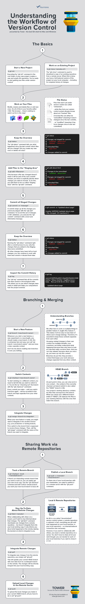  
Image Reference: [Tower](https://www.git-tower.com/learn/cheat-sheets/vcs-workflow)

***

## Q5:

> *"The goal of testing software is not to find bugs or to make software better. It’s to reduce risk by proactively finding and eliminating problems which would most greatly impact the customer using the software."* [1]

We test software by identifying which sections are most likely to have the biggest risk of causing this impact, and determining an array of tests to ensure the functionality is working correctly and as intended. 

If the test results in an error, the bug is logged and ranked on severity. Most of these bugs will be fixed, but if they have a low impact, they might be noted and remain in the system with a solution in the FAQs. 

The 2 most popular ways to test software come down to manual vs automated. To briefly cover Manual Testing, first here is an image on the different types of Manual Testing we see in industry: [2]

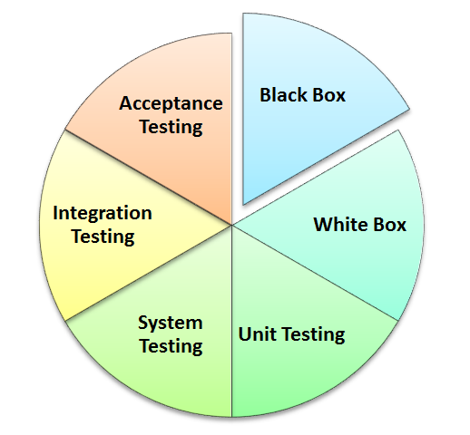  

Manual testing is where Testers manually run different use cases of the software to find bugs. Automated tests can be then created after first running these manual tests. 
Below is an outline on the process of running manual tests:

- Read the software documentation plan.
- Determine Test cases that cover the requirements in the docs.
- Review test cases with the team lead and client.
- Run the tests.
- Log any bugs.
- After bugs are fixed, run the failing test cases to validate.

The key concept is for the software to be as error free as possible and conforms with the requirements. 

To leave you with a few interesting facts.
> - *Testing requires many skill sets and cannot be done by 'anyone'.*
> - *Manual testing is always important in combination with automated testing, as 100% test automation is impossible.*

***Resources Used:***  
[1] [Usersnap](https://usersnap.com/blog/software-testing-basics/)  
[2] [Guru99](https://www.guru99.com/manual-testing.html)

***

## Q6:

Cyberthreats are increasing at an exponential rate in the tech industry, and the bodyguard to protect against these are the Information System Securities that companies (need to) put in place. Because these threats could (and do!) endanger businesses. [2]

There are several different security precautions that companies and individuals can take to improve security and secure their personal computing environment respectively. The fundamentals behind these precautions can be described in terms of three major requirements, and they are: [1]

**Confidentiality**, **Integrity**, **Availability** (CIA) - which make up *'The Information Security Triad'* [3]

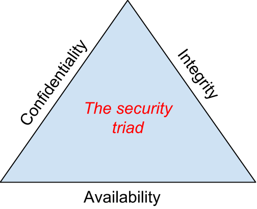

### **Confidentiality:**
The underlying essence of confidentiality comes from the protection of information. Meaning, we need to be able to restrict access to only those who are allowed to see it.  
*E.g. Keeping hackers prying eyes off of other individual's information.*   

### **Integrity:**
The integrity of information is about ensuring that the information being accessed is of true intention. Meaning that information has not been altered in any way to mis-represent its contents.   
*E.g. This can be in the form of a hacker changing the contents of a file, or when there may be a power surge that accidentally deletes or corrupts a file or information.*

### **Availability:**

The availability of the information means that it can be accessed and modified in an appropriate time frame by any authorized person to do so. This does not necessarily mean that the information is accessible immediately in every scenario. As it depends on the situation as to when the information needs to be available.  
*E.g. Stock traders need the information to be immediately available, but a business owner might be happy to have the sales of the previous day available the next morning.*  [3]

A little extra on the types of measures to mitigate security threats.

> *One might think that simply using a user ID and password is a secure method of authentication. But using a single-factor of authentication is extremely easy to compromise.*

Here are some measures that both companies and individuals can take for better information security. Some of these will be discussed in the next question.
- Authentication (2-factor)
- Access Control
- Encryption
- Backups
- Firewalls
- Virtual Private Networks
- Physical Security
- Security Policies

***Resources Used:***  
[1] [National Academies Press](https://www.nap.edu/read/1581/chapter/4)   
[2] [ProServeIt](https://www.proserveit.com/blog/information-security-requirements)  
[3] [PressBooks](https://bus206.pressbooks.com/chapter/chapter-6-information-systems-security/)

*** 

## Q7:

<!-- Following on from the previous question about measures a company can implement to secure their user's information, I would like to discuss **Two-Factor Authentication (2FA)**, **Firewalls** and **Physical Security**.  -->

Following on from the previous question about measures a company can implement to secure their user's information, I would like to discuss **Two-Factor Authentication (2FA)** and **Physical Security**.

### **Two-Factor Authentication (2FA)**

This method should not only be used for marketplace applications, but all companies that store user data. 2FA works by sending a token (a numeric code that's sent via phone or email) to the user, or retrieved from an authenticator such as [Google Authenicator](https://en.wikipedia.org/wiki/Google_Authenticator), which the user then inputs into the website they are trying to log in on. Which then confirms to the system that this is a genuine log in attempt. This significantly decreases the possibility of an attack from a hacker. (read. decreases, not prevents).   
*This method is not mandatory, and some sites leave it up to the user if they wish to use it, in turn leaving their users more compromised. However, a great deal more companies are making it a mandatory step of sign up.*

<!-- ### **Firewalls**

A company can install both hardware and/or software firewalls.  
- A hardware firewall is a device that is connected to the company network which filters packets based on a set of criteria. 
- Software firewalls run on an operating system and intercept the packets as they arrive to computers. 

Firewalls may also be installed so to restrict the possibility of employees watching YouTube videos or using Facebook from their company computer. It achieves this by restricting the flow of packets leaving the company network.

So if a hacker was to try and infiltrate the network with compromised data, then a firewall helps protect against any incoming information if it doesn't meet the strict set of criteria that was put on the system. -->

### **Physical Security**

At first this seems silly, but an organisation can implement the best digital security in the world, but it is not complete without physical protection of the hardware that is used.

Some measures include:

- *Locked doors*: If an intruder can just walk in and literally remove a computing device, then everything else is useless. 
- *Physical intrusion detection*: By using security cameras that detect unauthorized access to the physical locations of the data.
- *Secured equipment*: Devices should be secured away/down in a manner to prevent them from being stolen.
- *Environmental monitoring*: An organization’s high-value equipment should be kept in a room that is monitored for temperature, humidity, and airflow to prevent overheating.
- *Employee training*: One of the most common ways thieves steal information is to steal employee laptops while they're traveling.

***Resources Used:***  
[1] [PressBooks](https://bus206.pressbooks.com/chapter/chapter-6-information-systems-security/)

*** 

## Q8:

In Australia, the legal obligations for tech companies falls under the Australian Privacy Principles (or APPs), which are the cornerstone of the privacy protection framework in the Privacy Act 1988 (Privacy Act). [1]

There are 13 Australian Privacy Principles which govern standards, rights and legal obligations around: [1]  

- *The collection, use and disclosure of personal information.*
- *An organisation or agency’s governance and accountability.*
- *Integrity and correction of personal information.*
- *The rights of individuals to access their personal information.*  

Organisations not adhering to these rules and regulations can face serious financial penalties for such privacy law breaches.

These penalties are intended to protect Australians (especially children) using the Internet, *'without impeding the continued innovation and development of companies working in the online space [2].'* Also bringing Australia more in line with the General Data Protection Regulation (GDPR) implemented in other parts of the world.

*E.g. A breach is the collection or disclosure of an individuals private information without the individual's consent. This can either be deliberate or accidental.*

***Resources Used***  
[1] [Australian Government | Office of the Australian Information Commissioner](https://www.oaic.gov.au/privacy/australian-privacy-principles/)  
[2] [McCullough Robertson Lawyers](https://www.mccullough.com.au/2019/04/09/its-no-secret-10-million-penalties-to-be-introduced-for-privacy-law-breaches/)

***

## Q9:

A relational database maintains data in tables. They provide an efficient, intuitive, and flexible way to store and access structured information. They consist of:
**Tables** (also known as relations)
- which in turn consist of **columns** (that contain data this is categorized), 
- and **rows**, (that contain data defined by the category/column).

The data in these tables (each with a unique identifier) is accessed by using the SQL programming language which follows the ACID (Atomicity, Consistency, Isolation, Durability) properties. [1]

There are 3 majors components of a model: **Structure**, **Integrity**, and **Manipulation**. The **'Structure'** component is the relation itself, which is defined over types. 

> *"A type is basically a conceptual pool of values from which actual attributes in actual relations take their actual value."* [2]

Finally, the relational model has 4 different type of keys that are used. They are:

- A **Super Key**
  - which is a set of attributes that cannot contain the same value. 
  - *(e.g. passports/phone numbers)*
- A **Candidate Key** 
  - which is is a super key, but does not contain any unnecessary attributes.
  - *(e.g. we don't need to have a passport and a phone number on the same attribute to identify someone)*
- **Primary Keys**
  - The primary key is mainly used as a cross-reference to other relations. It is very similar to a candidate key.
- **Foreign Keys**
  - A foreign key is the other side of that cross-reference. It will match the primary key of another relation

***Resources Used:***   
[1] [Omni-Sci](https://www.omnisci.com/technical-glossary/relational-database)  
[2] [O'Reilly](https://www.oreilly.com/library/view/sql-and-relational/9781449319724/ch01s04.html)  
[3] [SWEN 220](http://www.se.rit.edu/~swen-220/slides/SWEN-220-DataModels_01_Relational.pdf)

***

## Q10:

The **'Integrity'** component of a relational database is a boolean expression constraint, that evaluates to TRUE for a set of relations. [1]

A relational database management system (RDMS) has 2 main constraints placed upon it, and they are: 

- Entity integrity constraints
  - *Primary key attributes don’t permit nulls* [2]
  - You can have nulls in other positions, just not the primary key as we would never know what data we are referencing. 
- Referential integrity constraints 
  - Must not contain any values that have unmatched foreign keys. That means that if 'A' has a reference to 'B', then 'B' must exist. There must be that equal value for this constraint to be valid.

***Resources Used:***   
[1] [O'Reilly](https://www.oreilly.com/library/view/sql-and-relational/9781449319724/ch01s04.html)  
[2] [SWEN 220](http://www.se.rit.edu/~swen-220/slides/SWEN-220-DataModels_01_Relational.pdf)  

***

## Q11:

The manipulative part of a relational database can be described in 2 parts (in regards to Computer Science):

- *Relational algebra*, which is a collection of operators that can be applied to relations that—speaking very loosely to allow us to derive “new” relations from “old” ones

- A *relational assignment* operator, which allows the value of some relational expression to be assigned to some relation and is fundamentally how updates are done in the relational model. [3]

There are 3 basic operations/manipulations performed on relational databases/model, and they are: *insert, update, and delete* [1].  All three statements allow you to change data in the database, not changing the structure but changing the content. They are different from the SELECT statement, which only allows you to read the data from the database (i.e. not manipulation). [4]

- **Insert Operation**  
  The INSERT statement adds new records to your database table which are usually added at the end of the table, on the condition the data satisfies the rules in the database.[4]

- **Update Operation**  
  The UPDATE statement allows us to modify existing records/rows in a table. [4]

- **Delete Operation**  
  The DELETE statement has the ability to delete one or more records in full. And we must ensure that the record / value is not being used by another table, otherwise we will cause an error due to a relation missing. [4]

Whenever one of these operations are applied, **integrity constraints** specified on the relational database schema must never be violated. [1]

***Resources Used:***   
[1] [Guru99](https://www.guru99.com/relational-data-model-dbms.html/)  
[2] [SWEN-220](http://www.se.rit.edu/~swen-220/slides/SWEN-220-DataModels_01_Relational.pdf)  
[3] [O'Reilly](https://www.oreilly.com/library/view/sql-and-relational/9781449319724/ch01s04.html)  
[4] [Simplilearn](https://www.simplilearn.com/data-manipulation-in-sql-tutorial)  

*** 

## Q12:

The 2 sorting algorithms I wish to investigate are **Bubble Sort** and **Merge Sort**.

First let's talk about how Big O works. As can be seen in the Comparison graph below we have 5 different graphs, and on our X Axis we have the number of pieces of data (n), and on the Y axis we have time (t). Seen in first graph closest to the X axis O(1), no matter how many pieces of data we have, our time does not increase. However, on the graph closest to the Y axis O(n², as our data increases, our time increases exponentially. Where the former is very efficient and *ideal*, and the latter being very inefficient, ideally a method we should try to *avoid*. 

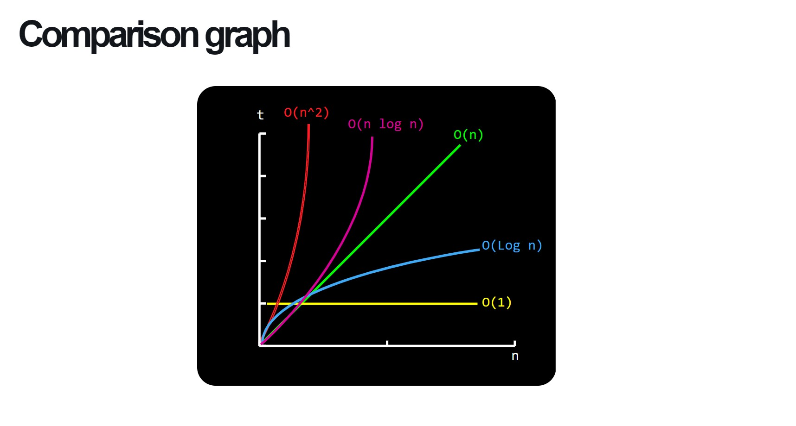
[1] Figure above: *Big O Comparison Graph*.

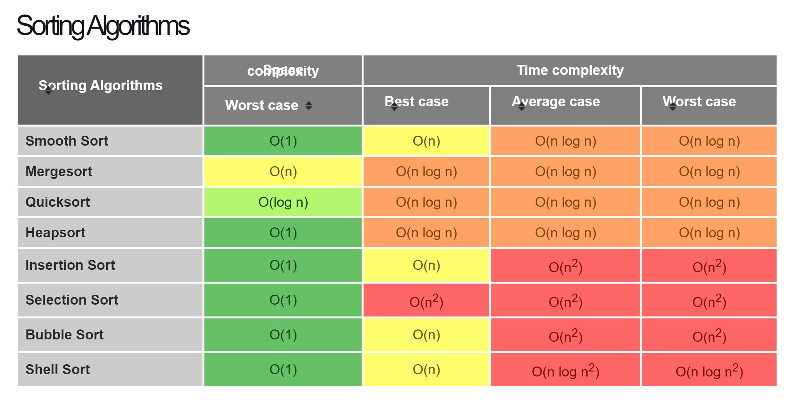
[1] Figure above: *Big O in regards to Sorting algorithms*.

Above we can see different types of sorting algorithms in regards to their space and time complexity. The 2 algorithms I have chosen are Bubble Sort and Merge Sort, due to the nature of how they scale. In the picture below, it shows how quickly time increases when the size of our data pool increases. 

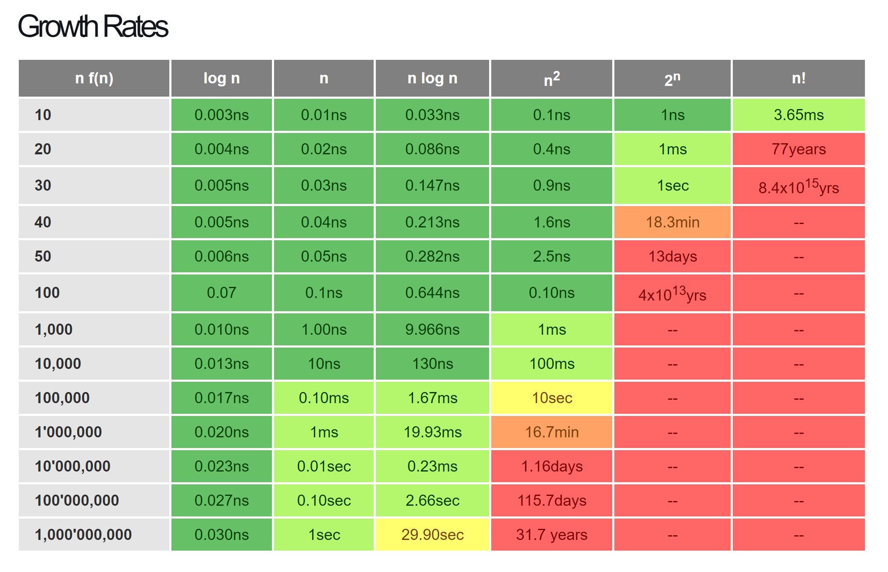
Figure above: *Time growth rates in regards to Big O and number of iterations.*.

### Bubble Sort
 Bubble Sort is an algorithm that uses 2 loops that iterate through the input array, where it constantly compares and swaps adjacent elements if they are out of order. The bottom level loop is the loop that swaps out the elements, whereas the top level loop ensures that it uses the inner loop to iterate over each element in the input array.

An example of this is when we are given an array of numbers in the order [5,3,4,1,2]. It takes a total of 3 passes to complete the sorting and the actions taken. The reason Bubble Sort is O(n²) time (as seen in the table), is due to each pass of the array, needing to iterate through the full array another whole time, so that it can do the comparisons and swaps.

### Merge Sort

The other chosen algorithm (Merge Sort) that we're looking at, is one of the most efficient. The algorithm is recursive and it is also classified as a Divide and Conquer (D&C) algorithm.

D&C is a common pattern for a lot of algorithms, and it follows these three steps:
1. Break down (divide) the original input into smaller and smaller instances of an array. 
2. Conquer these smaller instances recursively.
3. Recombine the results.

In the case of Merge Sort we recursively call a method to divide the input in half, over and over, until we get to a single element array, as seen in the image below.

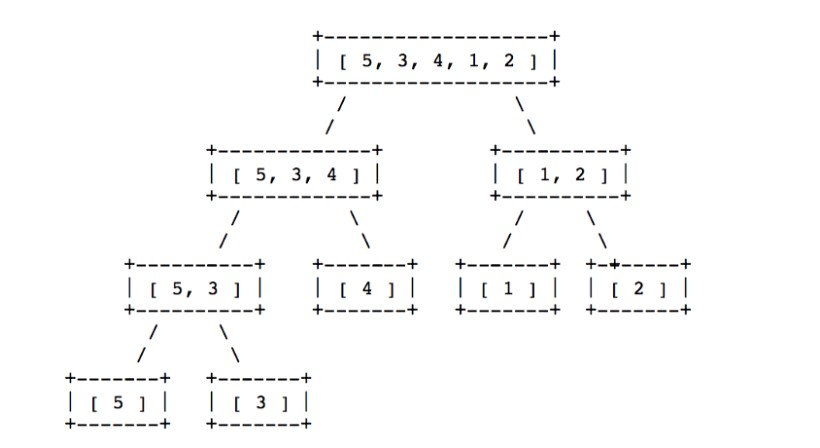
[3] Figure above: *How Merge Sort divides up the data*.

When both arrays are sorted, we then continuously compare the lowest values of each array and then push them in a sorted array which we then output.
If one iteration completes then all the remaining elements of the other array are larger and can therefore be added to the sorted output array. 

We can compare the recursive calls in the tree diagram, to the characteristic halving of O(logn) functions. So we iterate through 'n' elements, log(n) times. Merge Sort, is a great deal faster and more efficient than Bubble Sort because of its O(nlogn) nature. [3]

***Resources Used:*** 

[1] [Cooervo Algorithms and Data Structures](https://cooervo.github.io/Algorithms-DataStructures-BigONotation/index.html)  
[2] [Cooervo Algorithms and Data Structures (Algorithms)](https://cooervo.github.io/Algorithms-DataStructures-BigONotation/algorithms.html)  
[3] [Medium](https://medium.com/@ssbothwell/sorting-algorithms-and-big-o-analysis-332ce7b8e3a1)   

***

## Q13:

To nutshell a search algorithm, our goal is to find the position of a certain value that is contained in a list.

The 2 main algorithms that do this are:

**Linear search** 
- Linear search is an algorithm that checks each item in the list, in order, until it is found.

**Binary search**
- Binary search requires that its input list is sorted. Then, it recursively gets the middle value of that list, and removes half of its values that are larger or smaller than the value we are trying to search for.

Regarding Big O, lets revisit the graph of functions again to see the level of efficiency.

[1] Figure above: *Big O Comparison Graph*.

A little bit about each method.

### Linear Search
This search method is the most basic. It works by simply checking each element sequentially in the list and comparing it against the value we are after, until the correct value is found.  
Therefore, the number of comparisons undertaken depends on the length of the list given.
So, if we were to search the list a large number of times and assuming that we want to look for all elements at some point, then on average we would search through half of the list each time. Meaning that the comparisons in a Linear Search scales linearly with the size of the list itself. We can write this as such, N/2, where N is the number of operations. This allows us to determine that a Linear Search has the order of N, i.e. O(N) in Big O.

|   Algorithm   | Best case | Expected | Worst case |
|:-------------:|:---------:|:--------:|:----------:|
| Linear search |    O(1)   |   O(N)   |    O(N)    |

This table shows the best and worst case for this search algorithm. Where the best case is if the first element in the list is the required value, if not, then our graph scales linearly. 

### Binary Search

Binary Search is the more efficient search algorithm out of the 2 methods, but it relies on the input list being sorted. We recursively apply the search process to smaller and smaller sub-lists of the original list by halving the search range each time.

It works by first checking what the middle element of the list is. If it is the value we are after, then we are finished. If it isn't, and it is a higher value than what we want, then repeat the search process for the middle element of the new smaller sub-list that consists of all the numbers that are less than the first middle element. We continuously apply this method until we reach our desired element.   
The number of comparisons needed, scale with the size of the list again, but much slower than Linear Search. We can summarise this as log 2N, or in Big O notation as simple O(log N) as we ignore the '2' due to it being insignificant.

|   Algorithm   | Best case | Expected | Worst case |
|:-------------:|:---------:|:--------:|:----------:|
| Binary search |    O(1)   | O(log N) |  O(log N)  |

The best case scenario for Binary Search happens when the first element of the list is the one we are looking for again, meaning only 1 search was required.

The previous tables discuss *'Time Complexity'* of our search algorithms, but we can also describe their space complexity – which is the units of space required for storage, excluding the space required to store the original input list.

|   Algorithm   | Space complexity |
|:-------------:|:----------------:|
| Linear search |       O(1)       |
| Binary search |       O(1)       |

None of these algorithms require much storage space, excluding the size of the input list. [1]

***Resources Used:*** 

[1] [Python Textbook](https://python-textbok.readthedocs.io/en/1.0/Sorting_and_Searching_Algorithms.html)

***

## Q14:

The marketplace website/app I have chosen to research is [Fiverr](https://www.fiverr.com/?source=top_nav). For my own Rails assessment app, I plan to do a marketplace for skill-sharing, which is why I am analysing this site. Fiverr is an online marketplace that focuses on providing a platform for freelancers to offer their digital services to customers worldwide in over 300 categories. 

### **a) Application and Data Technologies**

Below is a table of all the software that is used in the creation of Fiverr. [1]

> |           |              |            |            |             |               |
> |-----------|--------------|------------|------------|-------------|---------------|
> |   jQuery  | JavaScript   | Python     | nginx      | React       | MySQL         |
> | MongoDB   | Google Drive | Redis      | Sass       | Ruby        | Android SDK   |
> | Rails     | Go           | RabbitMQ   | Amazon RDS | Objective-C | Handlebars.js |
> | Memcached | Apache Spark | Hadoop     | R Language | Neo4j       | InfluxDB      |
> | Sinatra   | Unicorn      | Cloudinary | MEAN       | Grape       |               |

According to an answer on Quora by Mohammed Jahangir Hossain, it seems that Rails is used for the backend framework [2].

Looking at the listed technologies used, there is a substantial amount going on here. My guess is that it would seem that React is probably for parts/most of the frontend of the main website as they are using MEAN for their tech stack, but they don't list Angular or Express.js. And using both SQL and NoSQL databases in MongoDB and MySQL. There is a large mix of technologies at play here and there doesn't seem to be a

233333333330  site expressing exactly how they all integrate with one another.
 
 

### **b) Hardware used for Hosting**

Unfortunately it wasn't possible to find who hosts Fiverr as they mask their IP address using Cloudfare, Inc. I used [this website](https://www.whoishostingthis.com/#search=www.fiverr.com) to source this information. As we can't find the exact company that hosts the site, we will take a short deep dive into Cloudfare's hardware instead.

CloudFlare provides protection from Distributed Denial of Service (DDoS) attacks, which is when someone tries to overwhelm a site with requests from all around the world, which make cause a server to overload and be unable to provide its services to its clients. [5]

Cloudfare does this with their new *(Gen X)* servers which are deployed across major US cities, and soon to be worldwide *(as of February 2020)*. Compared to their previous *(Gen 9)* servers, *pictured below*, *(Gen X)* processes 36% more requests while substantially more cosft-effective. [6]

Cloudfare uses these servers to handle the load of DDoD attacks and also to mask Fiverr's IP Address.

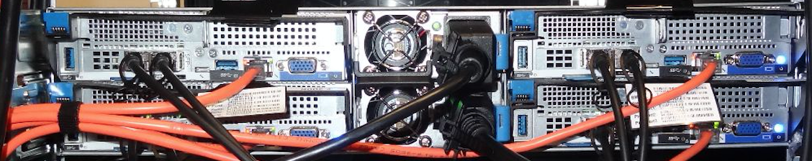
*Figure above: Cloudfare's Gen 9 Server*.

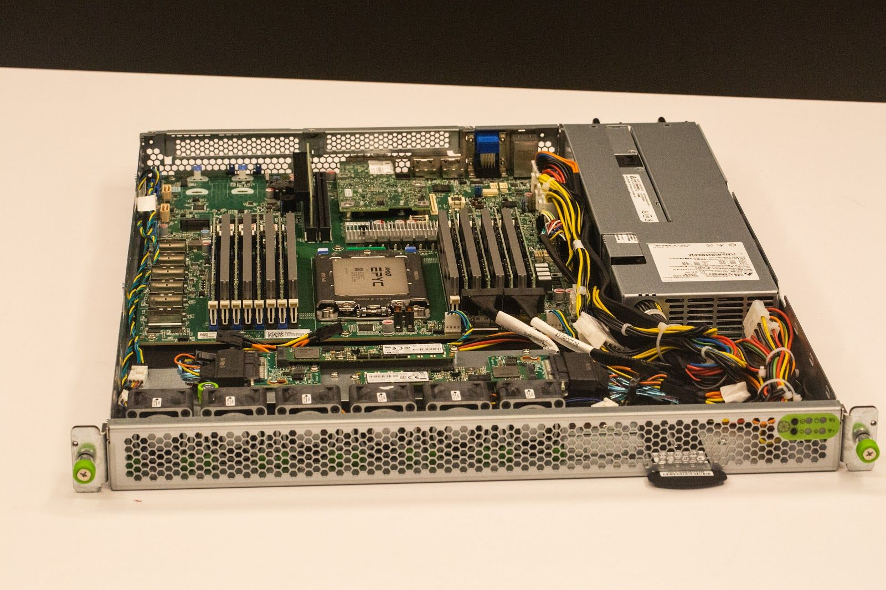
*Figure above: Cloudfare's newest Gen X Server*.

 
 

### **c) Interaction of Technologies**

After exploring further, [w3techs | sites](https://w3techs.com/sites) was brought to my attention which gave more insight into Fiverr' tech stack. From here, it was seen that PHP and Ruby is used as the server-side languages and JavaScript as client-side. This makes me believe that Rails (alongside PHP) was used in combination with React and jQuery to build the majority of site.  [4].  
Further estimates about their tech stack; 
- HTML and Sass for the layouts/views
- Android SDK for the Android app
- Objective-C for the iOS app
- Cloudinary for image storage
- Amazon RDS for scalability of their databases
- Google Drive and Gmail for company utilised technologies and email server provider
- nginx, Redis, Memcached, Neo4j, for additional database/memory options for their databases
- RabbitMQ for a messaging platform
- Handlebars.js for HTML and JS code optimisations
- Apache Spark and Hadoop for big data analysis
- Go in combination with InfluxDB for more database options *(so many databases!)*
- Sinatra as another micro-framework used somewhere
- MEAN stack?
- *unsure of Fiverr's use of Grape and Unicorn*

 

### **d) Data Structure**
  <!-- d. Describe the way data is structured within the app -->

As Fiverr uses both relational and non-relational databases, it is hard to say exactly how it is structured within the app. But, we can analyse how data is structured in both databases. 

Fiverr Non-Relational Database: *MongoDB*
- MongoDB is a no-SQL database that structures its data in a collection of JSON documents.

Fiverr Relational Database: *MySQL*
- MySQL is an SQL database that structures its data in tables with rows and columns where one queries a table for a certain piece of data. Some of these pieces of data is related to another data set through an identifying key, which is where it gets its 'relational' name from. 

 

### **e) Tracked Entities**

Thinking about the entities Fiverr would track with their website, this is my take on what I believe they are as there was no available information on this topic.

>|     MAIN ENTITIES    |      USER     |       SELLER      |      CATEGORIES     |      GIG     |    SERVICES    |  REVIEW  |  BUSINESS ANALYTICS |
>|:--------------------:|:-------------:|:-----------------:|:-------------------:|:------------:|:--------------:|:--------:|:-------------------:|
>| Children of Entities |  credentials  |       rating      |    graphic_design   |    images    | sub_categories |   user   |     company_info    |
>|                      |      type     |        name       |  digital_marketing  | sub_category |                |  rating  |       averages      |
>|                      |  account_type |    description    | writing_translation |     plans    |                | location | financial_analytics |
>|                      |  description  |      language     |   video_animation   |     queue    |                |  review  |  sellers_analytics  |
>|                      |     image     |       skills      |     music_audio     |    reviews   |                |          |   users_analytics   |
>|                      | personal_info | professional_info |   programming_tech  |     about    |                |          |  category_analytics |
>|                      |     saves     |  linked_accounts  |       business      |    seller    |                |          |                     |
>|                      |               |       image       |      lifestyle      |     saves    |                |          |                     |
>|                      |               |                   |      industries     |     price    |                |          |                     |

*Author Note: Just want to point out that I have only included 'sub-categories' in for services. This was due to the sheer amount of sub-categories for each category present, being too many to put on one table.*  

Looking around different parts of their website, these are some of the things I believe Fiverr to track and store on their database. They have a very large selection of services available, so tracking and storing them all would have be time consuming. I have also included Business Analytics as I would imagine they track a lot of data, not necessarily store it all as they would be unnecessarily using space on their databases, however, they would have a backend page to show a lot of data to authorized employees to manage it and utilise to make further business decisions to stay *'Agile'*. 

 

### **f) Relationship between Entities**
  As can be seen in *Q14: (e)*, my interpretation of how these entities are connected would be as followed.

**Table:  *USERS***
- has many Messages
- has one Seller *(note: if account_type is 'Seller')*

**Table:  *MESSAGES***
- has many Users

**Table:  *SELLERS***
- has one User
- has many Gigs

**Table:  *CATEGORIES***
- has many Services

**Table:  *SERVICES***
- Sub Category belongs to Categories

**Table:  *GIGS***
- belongs to Seller
- belongs to Services / Sub Category
- has many Reviews

**Table:  *REVIEWS***
- belongs to Gig
- belongs to User

**Table:  *BUSINESS ANALYTICS***
- *no connections*

 

### **g) Entity Relationship Diagram Schema**

[Here is the link](https://dbdiagram.io/d/5f0d495f0425da461f04a1d6) to the Entity Relationship Diagram for my assumption of Fiverr's database, designed on [dbdiagram.io](https://dbdiagram.io/home).

**NOTE!** *If unable to see the relationships in the picture, please visit the link above to view the ERD online. Here, you can hover over the tables and lines to see the relationships. bdiagram.io use the 1 and * to denote 'one' and 'many', and with 'many' to 'many' relationships, it was advised we use two one-many relations.*

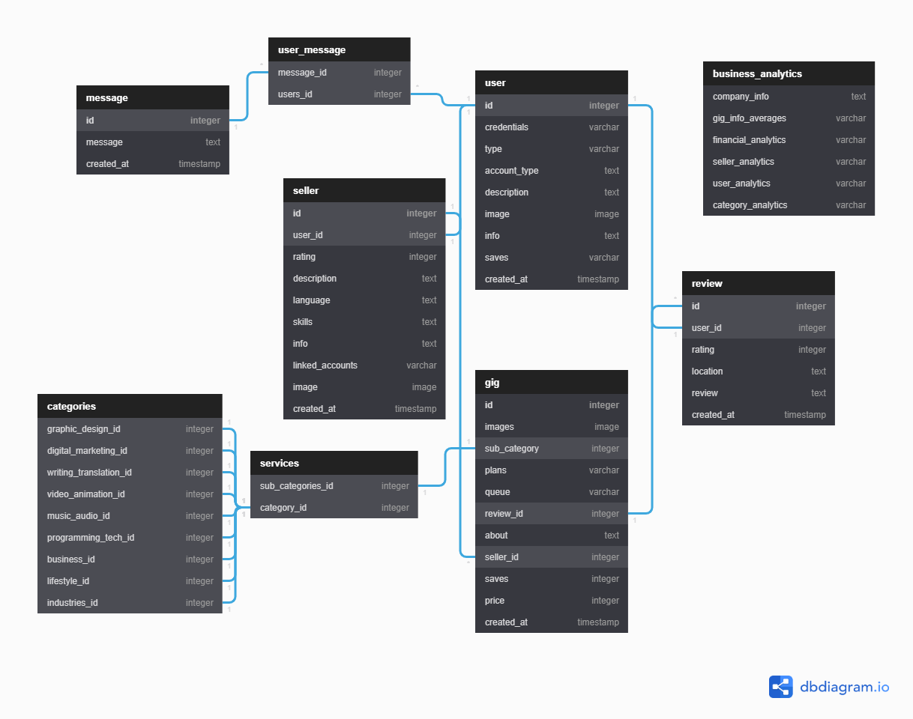

As there was no information regarding the layout of Fiverr's database, but as can be seen in *Q14: (f)*, I took an educated guess about the actual entities and relationships used in the site. I know that my interpretation will not be correct as I am but a student. But this is my interpretation on how some of the entities may be connected. 

***Resources Used:***  
[1] [StackShare](https://stackshare.io/fiverr/fiverr)  
[2] [Quora](https://www.quora.com/What-backend-technologies-does-Fiverr-use)  
[3] [dbdiagram.io](https://dbdiagram.io/home)  
[4] [w3techs](https://w3techs.com/sites/info/fiverr.com)  
[5] [Cloudfare | Blog | DDoS Prevention](https://blog.cloudflare.com/ddos-prevention-protecting-the-origin/)  
[6] [Cloudfare | Blog | Cloudflare’s Gen X Servers](https://blog.cloudflare.com/cloudflares-gen-x-servers-for-an-accelerated-future/)  

 

***
Thanks for reading.  
[Go to Navigation at Top](#Navigation).

***

## Author
Simon Curran