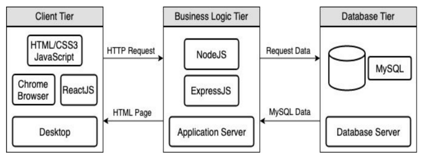

# T3A1 - Workbook
##### By Simon Curran
  


**NOTE:** *To find [my README.md](https://github.com/SimoSultan/ca-assignments/tree/master/t2a1) on GitHub if you're reading the PDF...*  
**SEARCH:** *SimoSultan -> Repositories -> ca-assignments -> SimonCurran_T3A1*  


#### Navigation:
- [**Q1**](#Q1) - Source Control Process
- [**Q2**](#Q2) - Important Aspects of Quality Software
- [**Q3**](#Q3) - MERN Stack High Level Structure
- [**Q4**](#Q4) - Knowledge and Skills for Projects
- [**Q5**](#Q5) - Own Project e.g. of Knowledge and Skills
- [**Q6**](#Q6) - Own Project e.g. Evaluation
- [**Q7**](#Q7) - JS Control Flow
- [**Q8**](#Q8) - JS Type Coercion
- [**Q9**](#Q9) - JS Data Types
- [**Q10**](#Q10) - JS Array Manipulation
- [**Q11**](#Q11) - JS Object Manipulation
- [**Q12**](#Q12) - JS JSON Manipulation
- [**Q13**](#Q13) - Comments for Code Snippet


----

## Q1:
<!-- Provide an overview and description of a standard source control process for a large project -->
<!-- Provides an extensive overview and description of a standard source control process -->

Whether you are developing a small or large project, source control, or version control, is a vital component of that process. Over time, a clear front-runner in this category has been Git and GitHub. Git is the source control, and GitHub is the GUI for your Git project. The benefit of Git is seen through its version history and branches. When Git is enabled into a text editor, we can see the history and changes in a file when they are merged/pulled, and branches allow developers to work on a copy of another branch, without disturbing the main branch, *trunk*, of the app.

According to Atlassian, there are 4 types of workflows/processes that companies can utilise, and they are:

- Centralized, 
- Feature Branch,
- Gitflow,
- Forking,

One of the more popular processes for version control comes from the **Feature Branch** workflow. All development within a company is worked on branches to the **master/main** branch. Features are developed on these branches, then submitted into Pull Requests for senior developers/admin to signed off on and approved, which is then submitted into the **master/main** branch. This workflow is highly advantageous as the **master/main** branch *should* never contain any broken code because it is never disturbed. 

This process/workflow forms the basis to the *Gitflow* and *Git Forking* workflows as well. Proving that this process is fundamental in nature for source control. 

***Resources Used:***  
[1] [Adrien Mejia ](https://adrianmejia.com/ruby-on-rails-architectural-design/#:~:text=Model%2DView%2DController%20Pattern,deals%20with%20the%20application%20flow.)  


----


## Q2:
<!-- What are the most important aspects of quality software? -->
<!-- List discuss and demonstrate 6 software quality characteristics. -->

According to the [CISQ Software Quality Model](https://www.it-cisq.org/standards/code-quality-standards/) the four major indicators for software quality come down to: [1]
- Reliability
- Performance Efficiency
- Security
- Maintainability 

However we can further elaborate on these ideas by adding that are talked about in the resources provided: [2] [3] which are also seen in the [ISO 25010:2011](https://www.iso.org/standard/35733.html). 

- Testability [2] [3]
- Usability [2] [3]
- Portability [3]
- Rate of Delivery [2]


To briefly discuss these a little further.

**Reliability:** *The expectation a user can have that the software they are using will work. There should be little to no errors, and if there are, they should be handled gracefully.*

**Performance Efficiency:** *The software's performance and scalabilty should not affect its response/load times, therefore keeping customers satisfied.*

**Security:** *The software should protect its own and its user's information against attacks which can be found through vulnerabilities in the code*

**Maintainability:** *The ability to be able to modify the software and adapt it for other purposes. If the codes architectural rules are consistent across the codebase, it is also more maintainable.*

**Testability:** *The more testable the software is, the more faults and bugs that can be found before it the product is shipped to users.*

**Usability:** *One of the most important parts of good software, if it is has good usability (i.e. UI / UX) then it will attract more users to the software. A good UI is something that is simple and quick at its tasks.*

**Portability:** *The portability of the software allows the code to be decoupled and reused for different operating systems and/or hardware with ease.*

**Rate of Delivery:** *This is where the Agile Methodology of a company can be seen. This means that new versions are often shipped to users often, that offer improvements and new features.*


***Resources Used:***  
[1] [CISQ](https://www.it-cisq.org/standards/code-quality-standards/)   
[2] [Altexsoft](https://www.altexsoft.com/blog/engineering/what-software-quality-really-is-and-the-metrics-you-can-use-to-measure-it/)   
[3] [Silas Reinagel](https://www.silasreinagel.com/blog/2016/11/15/the-seven-aspects-of-software-quality/)   


----


## Q3:
<!-- 	Outline a standard high level structure for a MERN stack application and explain the components -->
<!-- Shows almost flawless understanding of the high level structure of the app -->


The M.E.R.N. stack can be broken down into its components.

- MongoDB for the database
- Express.js for the routing
- React.js for the front-end library
- Node.js for the back-end/sever-side logic of the application. 

The biggest advantage of this stack is that every line of code is written in the same language, being no eed for context switching.

We can split this up again in an MVC (Model, View, Controller) terminology as well. Where the View *(Client Tier)*, Controller *(Business Logic Tier)* and Model *(Database Tier)* can be seen in the picture below.



Let's take a closer look at the Controller *(Business Logic Tier)* structure of an app, this is Express and Node.
**Node.js** and **Express.js** are used to communicate between the database **Mongo DB** and the client's user interface, which we use **React.js** to build. Express is a framework that harnesses the power of Node which allow us to simplify our routing logic, i.e. the HTTP methods **(GET, PUT, PATCH, DELETE)** that are used to get, send, receive and delete data from our database that can be displayed in the View to the user. [2] [3] [4] [5]


***Resources Used:***  
[1] [Git Connected](https://levelup.gitconnected.com/a-complete-guide-build-a-scalable-3-tier-architecture-with-mern-stack-es6-ca129d7df805)  
[2] [Express](https://expressjs.com/en/guide/routing.html)  
[3] [Node](https://nodejs.org/en/about/)  
[4] [Mongo DB](https://www.mongodb.com/blog/post/the-modern-application-stack-part-1-introducing-the-mean-stack/)  
[5] [Hyperion Dev](https://blog.hyperiondev.com/index.php/2018/09/10/everything-need-know-mern-stack/)  


----


## Q4:
<!-- A team is about to engage in a project, developing a website for a small business. What knowledge and skills would they need in order to develop the project? -->
<!-- Effectively describes a range of skills and knowledge required by IT workers to complete a quality web development project -->


----


## Q5:
<!-- With reference to one of your own projects, discuss what knowledge or skills were required to complete your project, and to overcome challenges -->
<!-- Effectively describes a range of skills and knowledge used to complete a project. -->

### Ruby on Rails 2-way Marketplace Project
**Skills Required**:
- Ruby language
- Rails framework for Ruby
- HTTP methods
- Heroku
- MVC architecture
- Routing
- PostgreSQL (SQL databases)
- Ruby Gems (Devise in particular)

I chose this project due to the sheer size and amount of technologies that were needed to be integrated. This project takes us from being able to code small programs, into being able to make a real, working web application, that is similarly used in industry. This was the hardest for me initially due to the new concepts that were involved, especially Rails and Routing. Rails fortunately uses custom database calls to make an SQL database function more like a non-SQL database. To discuss some of these skills further:

**Ruby:** *Ruby was the underlying language that was used throughout the entire app and probably the easiest aspect to the app. If stuck, resorting to [APIdock](https://apidock.com/) helped solve any issues.*

**Rails:** *Rails is the framework built from Ruby, and is used for the MVC (Model/View/Controller) architecture throughout the app. One of the hardest parts to Rails is best referred to 'Rails magic' that so many people talk about. Meaning, the amount of work that Rails does in the background for all the heavy lifting of the site. Not knowing about this can really slow someone down as the concepts are large, however, once learnt, the power of Rails becomes clear due to the sheer speed that someone can create a working MVP (Minimum Viable Product) for a client. Again, the Rails docs and also [APIdock](https://apidock.com/) were used to troubleshoot issues.*

**HTTP Methods:** *These refer to the HTTP requests made by the app. They are: [GET, PUT, PATCH, DELETE]. These allow the user to get, send, update and delete information from a database.*

**Routing:** *The routing of the application is handled in the 'routes.rb' file. Understanding how to tell Rails which controller and action to use based on the dynamic URL can be tricky, at least at first. Also, the Rails docs were used here should a problem arise.*

These are just some of the concepts and skills that were used in the project that were required to complete it and overcome the challenges.


***Resources Used:***  
[1] [SimoSultan's GitHub Repo DLM](https://github.com/SimoSultan/dlm)  


----


## Q6:
<!-- With reference to one of your own projects, evaluate how effective your knowledge and skills were for this project, and suggest changes or improvements for future projects of a similar nature -->
<!-- Evaluates effectiveness of knowledge and skills accurately, providing examples, and providing an insightful improvement on each skill -->

### Ruby on Rails 2-way Marketplace Project
**Skills Required**:
- Ruby language
- Rails framework for Ruby
- HTTP methods
- Heroku
- MVC architecture
- Routing
- PostgreSQL (SQL databases)
- Ruby Gems (Devise in particular)

The largest lack of knowledge for me was my experience with 'Ruby on Rails'. No particular technologies or skills were that difficult in this project, but whilst working through this assignment, I discovered that the best way to improve for any future project is continuous practice on one's current knowledge base. Personally found this out the hard way due to my lack of experience when passing data between the View and Controller through the params. Through persistence and researching the [Docs](https://guides.rubyonrails.org/) and [Stack Overflow](https://stackoverflow.com/) I was able to find the errors in my code and solve the problem. Not that I personally struggled with this, but really making sure to understand the database structure and their relations **one-to-one**, **one-to-many** and **many-to-many**, in the Entity Relation Diagram, also how to write those relations were a vital part at being able to have the database respond with the correct information on query. If one did not understand these concepts, or did not focus on understanding their relations in their ERD in the implementation plan, then achieving a working MVP would be incredibly difficult. At the end of the day, the most important part of learning any new skills when programming, is to practice. Start with a simple project/problem, and get that working, then play around with it, break it and fixing it will give much more of an understanding to the concept then trying to memorize the docs. For myself, reading up on the Docs when I came across a particular problem and finding the best solution in the docs was highly effective in design and bug fixing. 


***Resources Used:***  
[1] [SimoSultan's GitHub Repo DLM](https://github.com/SimoSultan/dlm)  


----


## Q7:
<!-- Explain control flow, using an example from the JavaScript programming language -->
<!-- Provides a thorough explanation of control flow in programming -->
Control flow is an fundamental part of life and a programming language. We can demonstrate control flow in JavaScript with a human example.

```js
if (youre_hungry) {
  return "go eat"
} else {
  return "don't eat"
}
```

We can write this code in shorthand, i.e. a one-liner with the ternary operator

```js
return (youre_hungry) ? "go eat" : "don't eat"
```

We can add additional if blocks to the original statement as well:

```js
if (youre_tired) {
  return "go sleep"
} else if (youre_exhausted) {
  return "lie down and rest"
} else {
  return "carry on"
}
```

However, writing out all these 'else if' statements can get tedious and end up being messy. This is where we can use the JavaScript **'switch'** statement to clean this code up. As seen below:

```js
switch (tiredness) {
  case youre_tired:
    return "go sleep"
  case youre_exhausted:
    return "lie down and rest"
  default:
    return "carry on"
}
```

If we weren't returning out of this switch statement, and wanted to execute some side-effect code, we can use the keyword *'break'* to exit out of the switch case and continue onto our next bit of code in the function/app.

Another thing we can also do with the switch statement in out control flow processes is short-circuit a case. So if we want both the youre_tired and youre_exhausted cases to return in the string "lie down and rest" we can write it like this:

```js
switch (tiredness) {
  case youre_tired:
  case youre_exhausted:
    return "lie down and rest"
  default:
    return "carry on"
}
```


***Resources Used:***  
[1] [Simon Curran's T1A1 Workbook](https://github.com/SimoSultan/ca-assignments/tree/master/SimonCurran_T1A1#Q8)


----


## Q8:
<!-- Explain type coercion, using examples from the JavaScript programming language -->
<!-- Provides a thorough explanation of type coercion in programming -->

> "Type coercion is the automatic or implicit conversion of values from one data type to another (such as strings to numbers)." [2]

There are 2 types of coercion: Implicit vs Explicit.

- **Implicit Coercion** *Implicit Coercion can be a blessing and a curse. We can use it to add an integer to the end of a string, seen below.*

```js
const string = 'A dog has this many legs: ';
const value2 = 4;
let sum = string + value2;

console.log(sum); // => logging the string 'A dog has this many legs: 4' to the console
```

However, we can also get into trouble, seen below in the example:

```js
let a = '9';  // class String
let b = 9;    // class Integer

a == b        // => true
a === b       // => false
```

Here we receive 2 different values. Because in the first comparison, we do do an implicit comparison, which does not include type, only the value. But in the second, we also compare type, as a String is not equal to an Integer, it returns false.


- **Explicit Coercion** *When we explicitly coerce a string to an integer for example. Demonstrating this in the example below.*

```js
let num = '6';
num = Number(num);
```
Here we a explicitly telling the compiler to change the string of '6' into an integer.


There are many more examples of type coercion in JavaScript. We should not try to remember every scenario, just understand the basics behind this concept and ensure our code checks or ignore type for specific situations. 
However, in my opinion, explicit coercion is better as it is makes the code more readable to another person what we are trying to achieve.

***Resources Used:***  
[1] [Simon Curran's T1A1 Workbook](https://github.com/SimoSultan/ca-assignments/tree/master/SimonCurran_T1A1#Q9)  
[2] [MDN](https://developer.mozilla.org/en-US/docs/Glossary/Type_coercion)


----


## Q9:
<!-- Explain data types, using examples from the JavaScript programming language -->
<!-- Provides a thorough explanation of data types in programming -->

***Resources Used:***
[1] [Simon Curran's T1A1 Workbook](https://github.com/SimoSultan/ca-assignments/tree/master/SimonCurran_T1A1#10)


----


## Q10:
<!-- Explain how arrays can be manipulated in JavaScript, using examples from the JavaScript programming language -->
<!-- Demonstrates an extensive ability to manipulate arrays -->

***Resources Used:***
[1] [Simon Curran's T1A1 Workbook](https://github.com/SimoSultan/ca-assignments/tree/master/SimonCurran_T1A1#10)
 


----


## Q11:
<!-- Explain how objects can be manipulated in JavaScript, using examples from the JavaScript programming language -->
<!-- Demonstrates an extensive ability to manipulate objects -->

***Resources Used:***
[1] [Simon Curran's T1A1 Workbook](https://github.com/SimoSultan/ca-assignments/tree/master/SimonCurran_T1A1#10)


----


## Q12:
<!-- Explain how JSON can be manipulated in JavaScript, using examples from the JavaScript programming language -->
<!-- Demonstrates an extensive ability to manipulate JSON -->


***Resources Used:***
<!-- [1] [Simon Curran's T1A1 Workbook](https://github.com/SimoSultan/ca-assignments/tree/master/SimonCurran_T1A1#10) -->


----


## Q13:
<!-- For the code snippet provided below, write comments for each line of code to explain its functionality. In your comments you must demonstrates your ability to recognise and identify functions, ranges and classes -->
<!-- Demonstrates an extensive ability to recognise functions, ranges and classes -->

The comments to the code snippet can be found [here](./q13CodeSnippet.js).


***No Resources Used:***


----


Thanks for reading.  
[Go to Navigation at Top](#Navigation).


----


## Author
Simon Curran